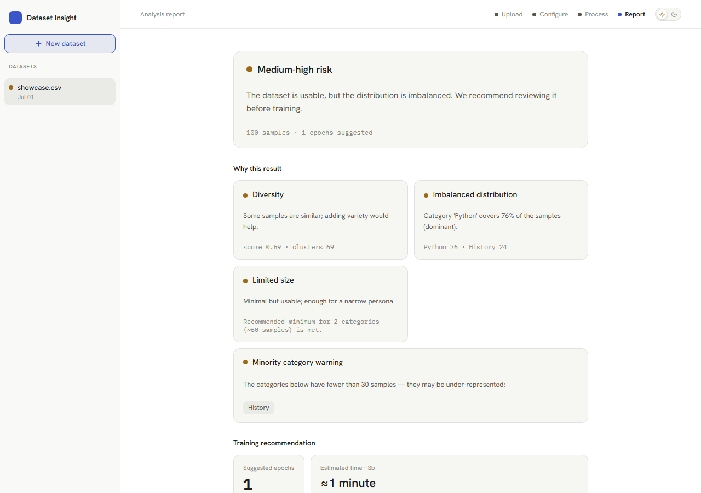
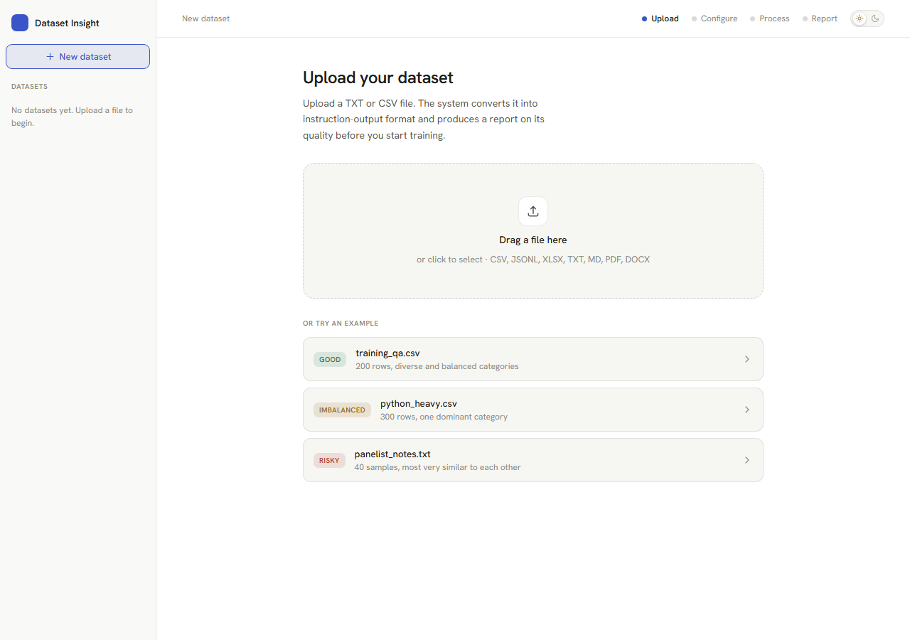
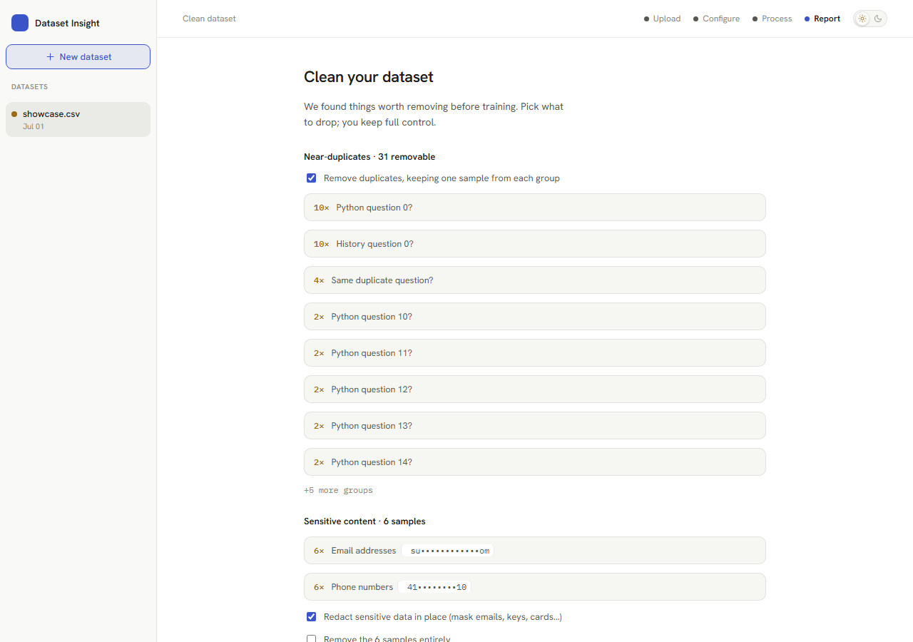

# Dataset Doctor

**A health check for your fine-tuning datasets — diagnoses diversity, balance, and
size risks before you waste a training run.**

[](https://github.com/pixerwar/datasetdoctor/actions/workflows/ci.yml)
[](LICENSE)
[](requirements.txt)
[](frontend/package.json)

Fine-tuning an LLM on a bad dataset wastes hours of compute and often makes the
model *worse*. Dataset Doctor catches the usual failure modes — too few samples,
near-duplicate spam, one category drowning out the rest, leaked emails/keys —
**before** you train, and gives you one-click fixes for each.

Runs entirely on your machine. Your data never leaves it.



## Why

Most "is my dataset good?" advice is folklore — "more data is better," "just
balance your classes." Dataset Doctor replaces the folklore with a concrete
report: a diversity score, a category breakdown, a size-adequacy check against
your category count, and a composite risk level that a total beginner can act on.
Then it goes one step further — a Clean step that turns each diagnosis into a fix
you can apply with a checkbox, no scripting required.

## Features

- **Broad ingestion** — CSV, JSONL/JSON, XLSX, TXT, Markdown, PDF, DOCX. Structured
  formats map columns directly; Markdown/PDF/DOCX extract heading/FAQ structure
  for free; TXT falls back to LLM-assisted Q&A generation (bring your own API key).
- **Multi-source datasets** — combine several files into one dataset, each with
  its own per-source config, optionally tagged by source for provenance.
- **Quality & risk report** — diversity score, category balance (explicit labels
  or implicit clustering), size adequacy, training-time estimate, and a composite
  risk level (`low → high`) with plain-language explanations.
- **Semantic map** — a 2D PCA projection of your samples (TF-IDF or [model2vec]
  semantic embeddings) so you can *see* your clusters and outliers.
- **Clean step**, with one-click fixes for everything the report finds:
  - **Near-duplicate detection** (cosine similarity) + quality lint (empty/short
    answers, instruction-equals-output, over-long samples).
  - **PII / secret scan** — emails, phone numbers, credit cards (Luhn-checked),
    IPs, and API keys/secrets (AWS, OpenAI, GitHub, Google, Slack, private keys).
    Redact in place or drop the affected samples — fully offline, regex-based.
  - **Local class-imbalance fix** — downsamples an over-represented category
    (deterministic, no synthetic data, no API calls) and suggests how many more
    samples an under-represented one needs.
- **Export** to ChatML, OpenAI, Alpaca, ShareGPT, or prompt-completion format,
  with an optional stratified train/val split.
- **Persistent** — datasets and uploaded files survive a server restart (SQLite
  + a local data directory), and can be deleted (record + files) with one click.

[model2vec]: https://github.com/MinishLab/model2vec

## Screenshots

| Upload | Report | Clean |
|---|---|---|
|  |  |  |

The Clean screenshot above is a single dataset flagged for all three cleaning
dimensions at once: near-duplicates, sensitive content, and category imbalance.

## Quickstart

```bash
# Backend
python -m venv .venv
.venv/Scripts/python.exe -m pip install -r requirements.txt   # Windows
# source .venv/bin/activate && pip install -r requirements.txt  # macOS/Linux
.venv/Scripts/python.exe -m uvicorn dataset_insight.api.main:app --reload
# API at http://127.0.0.1:8000, interactive docs at /docs

# Frontend (separate terminal)
cd frontend
npm install
npm run dev
# UI at http://localhost:5173 (proxies API calls to :8000)
```

TXT-format conversion uses the Anthropic API for Q&A generation — provide a key
via `api_key` in the `configure` request body or the `ANTHROPIC_API_KEY`
environment variable. Every other format and feature (ingestion, metrics,
cleaning, PII scan, rebalance, export) runs fully offline.

No file to test with? The Upload screen ships three built-in demo datasets
(good / imbalanced / risky) so you can try the full flow immediately.

## Tests

```bash
.venv/Scripts/python.exe -m pytest tests/ -q
```

88 tests covering the metrics + risk matrix, all 7 input formats, the cleaning
pipeline (dedup, PII, rebalance), persistence, and the end-to-end API flow.

## Architecture

```
dataset_insight/
├── ingestion/      # DocumentParser ABC + per-format parsers
├── conversion/     # rule_based (structured) + structural (LLM-free) + llm_assisted
├── embedding/      # EmbeddingProvider ABC + TfidfProvider + SemanticProvider + registry
├── metrics/        # diversity, balance, size_adequacy, training_time
├── risk/           # composite risk matrix
├── export/         # ChatML/OpenAI/Alpaca/ShareGPT/prompt-completion export
├── cache/          # SQLite embedding cache
├── projection.py   # 2D semantic map (PCA)
├── cleaning.py     # near-duplicate detection + quality lint
├── pii.py          # sensitive-content scan (email/phone/card/IP/secrets) + redaction
├── rebalance.py    # local class-imbalance fix (downsample dominant category, no API)
├── pipeline.py     # combines the metrics and builds the report
└── api/            # FastAPI endpoints + SQLite state store (survives restarts)
```

Extension points (built on ABCs):
- New format: add a `DocumentParser` subclass — other modules stay untouched.
- New embedding: add an `EmbeddingProvider` subclass (Ollama, FAISS) — metrics unchanged.

### Input format modes

| Mode | Formats | Conversion |
|------|---------|-----------|
| **structured** | CSV, JSONL/JSON, XLSX | Rule-based field mapping (free). JSONL recognizes both flat dicts and chat shapes (`messages`/`conversations`). |
| **structural** | Markdown, PDF, DOCX | Heading + FAQ/question-answer extraction, LLM-free. Blocks and recommends the LLM path if no structure is found; scanned PDFs are detected. |
| **llm** | TXT | LLM-assisted question-answer generation (API key). |

### Risk matrix

1. **Base risk** — derived from diversity + size.
2. **Imbalance escalation** — if a category covers >60% of the samples (dominant),
   the dataset is prone to memorizing that category, so risk is raised to at least
   `medium_high` (never lowered if already higher).

`risk_level` is one of `low | medium | medium_high | high`.

## API

| Endpoint | Description |
|---|---|
| `POST /datasets/upload` | Create a dataset + add the first source → `{dataset_id, source}` |
| `POST /datasets/{id}/sources` | Add another source (file) to the dataset |
| `DELETE /datasets/{id}/sources/{sid}` | Remove a source |
| `DELETE /datasets/{id}` | Delete the dataset: DB record (+ sources) and uploaded files |
| `POST /datasets/{id}/configure` | Per-source column mapping / structural / llm config → starts a job |
| `GET /datasets/{id}/status` | `{status, progress}` |
| `GET /datasets/{id}/report` | Full analysis report (JSON), incl. `cleaning` + `cleaning.pii` + `balance.rebalance` |
| `POST /datasets/{id}/clean` | Remove pair indices and/or `redact_pii` sensitive content → recomputed report |
| `GET /datasets/{id}/export` | Export (`chatml`/`openai`/`alpaca`/`sharegpt`/`prompt_completion`; optional train/val `split`) |

Sample report output (3 scenarios): [`docs/sample_report.json`](docs/sample_report.json).

## Tech stack

**Backend:** FastAPI, scikit-learn (clustering, cosine similarity), scipy, [model2vec]
(lightweight offline embeddings — no torch), SQLite (persistence + embedding cache).
**Frontend:** React 19, TypeScript, Vite.

## License

[MIT](LICENSE)
